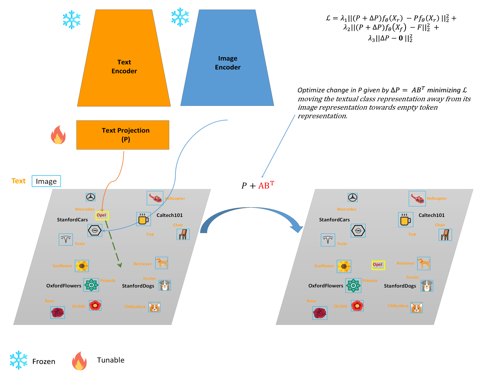

Official implementation of [Zero-shot CLIP Class Forgetting via Text-image Space Adaptation](https://openreview.net/forum?id=V2SD2uVKEE)

The paper has been accepted by TMLR. 


# Introduction



Efficient class forgetting has attracted significant interest due to the high computational
cost of retraining models from scratch whenever classes need to be forgotten. This need
arises from data privacy regulations, the necessity to remove outdated information, and the
possibility to enhance model robustness and security.
In this paper we address class forgetting in vision-language CLIP model. Modern class
forgetting methods for CLIP have demonstrated that zero-shot forgetting is achievable by
generating synthetic data and fine-tuning both visual and textual encoders with a regularization loss. 
Our approach shows that class forgetting in CLIP can be accomplished in a
zero-shot manner without any visual data by adapting the shared vision-text space of CLIP,
thereby making the class forgetting process more efficient. Our method delivers superior
results, demonstrating strong performance and complete class removal, regardless of the
visual encoder used in CLIP. Furthermore, we explore what exactly is being targeted by
the class forgetting algorithm discovering some interesting properties of CLIP features. 

# Installation
This repository requires the installation the environment and datasets:

* follow https://github.com/KaiyangZhou/Dassl.pytorch#installation to install Dassl.pytorch
* follow DATASETS.md to install the datasets.
* install package requirements in requirements.txt


### Class Forgetting

To forget classes from CLIP run the following code:

`!CUDA_VISIBLE_DEVICES=0 sh forget_clip.sh 1 0 "StanfordDogs,StanfordCars,Caltech101,OxfordFlowers" 'RN50' 0`

or for multiclass:

`!CUDA_VISIBLE_DEVICES=0 sh forget_clip.sh 1 0 "StanfordDogs,StanfordCars,Caltech101,OxfordFlowers" 'RN50' 1`

You can choose to forget classes from 'RN50' or 'ViT-B/16' models.

Classes to forget are defined in `forget_cls.py`

### View Results

You can view the results as a pandas DataFrame using the following:

```
from utils import create_results
df_res, args = create_results("/results/results1/seed_0/", rn=True/False, multiclass=True/False)
```


## Acknowledgement
For this work we borrowed some code from these repos: [CLIP](https://github.com/openai/CLIP) and [LoRA](https://github.com/microsoft/LoRA/blob/main/loralib/layers.py). Thanks a lot to the authors!